## The Viability of Blockchain Markets

Fayçal Drissi (University of Oxford)

 

**Part I.** Jaimungal, Drissi, and Wu (2025), *Equilibrium Liquidity and Risk Offsetting in Decentralised Markets*  
**Part II.** Capponi, Cartea, and Drissi (2025), *The Viability of Blockchain Markets under Discrete Clearing and Paid Priority*

 

Mathematical Institute, University of Oxford. 28 May 2026

 

These slides: [https://www.faycaldrissi.com/mempools-talk](https://www.faycaldrissi.com/mempools-talk)

---
section: Part I - passive liquidity
layout: two-cols-header
---

# Part I: Passive liquidity provision

::left::

### Motivation
- DEXs compete with centralised order books for the same flow
- On a CEX, active market makers run dynamic strategies
- On a DEX: LPs supply passively, no dynamic skewing/quoting $\implies$ need hedging

 

<v-click>

### Question: what level of liquidity a rational LP supplies realistically?

 

<v-click>

### Setup: a DEX as a constant function market

- A pool with reserves $x$ in $X$ and $y$ in $Y$
- LTs trade with the pool, LPs deposit or withdraw

</v-click>

</v-click>

::right::

<v-click>

### Pricing on a CFM

- Bonding curve $\varphi$ maps reserves $Y$ to reserves $X$: $x = \varphi(y, \kappa)$

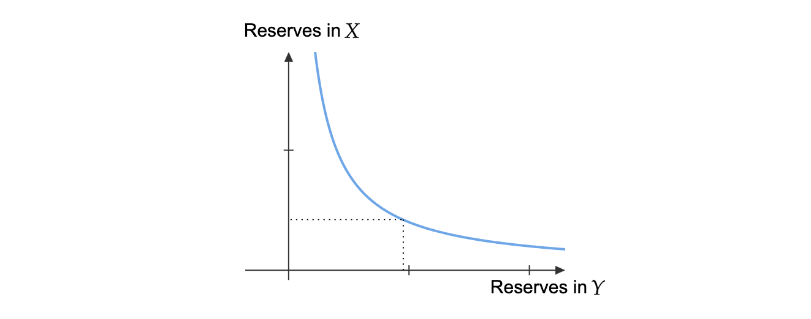{style="transform: translate(30%, -5%); width: 58%;"}

<v-click>

- For an LT trading a quantity $\Delta y$ of $Y$:
$$\footnotesize
\text{Ask} = \frac{\varphi(y - \Delta y, \kappa) - \varphi(y, \kappa)}{\Delta y} \qquad
\text{Bid} = \frac{\varphi(y, \kappa) - \varphi(y + \Delta y, \kappa)}{\Delta y}
$$

<v-click>

- As $\footnotesize \Delta y \to 0$ both converge to the **marginal price** $\footnotesize  -\varphi'(y, \kappa)$

<v-click>

- Price impact: a buy moves the marginal price to $\scriptsize -\varphi'(y - \Delta y, \kappa)$, and a sell to $\scriptsize  -\varphi'(y + \Delta y, \kappa)$
<v-click>

- LP sets $\kappa$ $\implies$ determines prices

</v-click>
</v-click>
</v-click>
</v-click>
</v-click>

---

# LP exposure

- Fundamental price $F$ satisfies
$$dF_t = A_t F_t\, dt + \sigma F_t\, dW_t$$
where $A_t$ is the LP's (possibly latent) private signal

<v-click>

- Arbitrageurs continuously align DEX and CEX prices:
$$F_t = -\partial_1 \varphi(Y_t, \kappa) \iff Y_t = h(F_t, \kappa)$$

</v-click>

<v-click>

- **Value of the AMM position** in units of $X$:
$$
d(X_t + Y_t F_t) = Y_t dF_t - \underbrace{\tfrac12\, \partial_{11}\varphi(h(F_t,\kappa),\kappa)\,\bigl(\partial_1 h(F_t, \kappa)\bigr)^2 \sigma^2 F_t^2\, dt}_{\text{adverse selection from passive liquidity}}
$$

$\implies$ the risk $Y_t dF_t$ must be hedged $\implies$ incurs costs  
$\implies$ **adverse selection must be compensated by fees**

</v-click>

---

# Model: three stages

<v-clicks>

- **Stage I**: risk-averse LP chooses reserves $\kappa$
- **Stage II**: LP chooses a dynamic CEX strategy $\nu$ to offset
- **Stage III**: arbitrageurs align prices, noise LTs arrive, LP executes

</v-clicks>

 

<v-click>

### Stage III: noise LT optimisation
nLT with private utility $V$ buys quantity $\delta$, executes at $F_t + \pi F_t + \tfrac12 \delta\, \partial_{11}\varphi(Y_t, \kappa)$ per unit

</v-click>

<v-click>

Optimal trade size:
$$\delta_t^\star = F_t \,\frac{|V| - \pi}{\partial_{11}\varphi(Y_t, \kappa)}$$

Stochastic fee revenue accruing to the LP:
$$\mathbb E\!\left[\int_0^T \pi\, \delta_t^\star\, F_t\, dN_t\right] = \int_0^T \Pi(F_t, \kappa)\, dt, \qquad \Pi(F, \kappa) = \frac{\lambda \pi (v - \pi) F^2}{\partial_{11}\varphi(h(F, \kappa), \kappa)}$$

</v-click>

---

# Stage II: LP criterion

CEX with linear transient impact $S_t^\nu = F_t + I_t^\nu$, with
$\qquad dI_t^\nu = (c\, \nu_t - \beta\, I_t^\nu)\, dt$

<v-click>

DEX reserves:
$$dY_t = G_t F_t\, dt + \sigma\, \partial_1 h(F_t, \kappa) F_t\, dW_t, \quad G_t = \partial_1 h(F_t, \kappa) A_t + \tfrac{\sigma^2}{2}\, \partial_{11} h(F_t, \kappa) F_t$$

</v-click>

<v-click>

### Combined criterion
$$\small
J[\nu] = \mathbb E\Bigl[\underbrace{(Y_T + Q_T^\nu)\, S_T^\nu}_{\text{combined position}} - \underbrace{\int_0^T (S_t^\nu + \eta \nu_t) \nu_t\, dt}_{\text{risk offsetting}} - \underbrace{\dfrac{\phi}{2} \int_0^T (Q_t^\nu + Y_t)^2\, dt}_{\text{deviation penalty}}\Bigr]
$$

</v-click>

<v-click>

<u>**Proposition.**</u> Define $\mathfrak{Q}, \mathfrak{I}: \mathcal A_2 \to \mathcal A_2$ by $\qquad (\mathfrak{Q} \nu)_t = \int_0^t \nu_s\, ds, \qquad (\mathfrak{I} \nu)_t = c \int_0^t e^{\beta(s - t)}\, \nu_s\, ds,\quad$ and the symmetric bounded linear operator $\Lambda: \mathcal A_2 \to \mathcal A_2$ given by
$$\Lambda := 2\eta + \beta\,(\mathfrak{I}^\top \mathfrak{Q} + \mathfrak{Q}^\top \mathfrak{I}) - c\,(\mathfrak{Q} + \mathfrak{Q}^\top) + \phi\, \mathfrak{Q}^\top \mathfrak{Q}$$

and $\upsilon \in \mathcal A_2$ given by $\quad \upsilon := \mathfrak{I}^\top (G F) + (c - \beta\, \mathfrak{I}^\top - \phi\, \mathfrak{Q}^\top)(Y + Q_0) + \mathfrak{Q}^\top (A F)\quad$
satisfy
$$\boxed{\,J[\nu] = -\tfrac12 \langle \Lambda \nu, \nu \rangle + \langle \upsilon, \nu \rangle\,}$$

</v-click>

---

# Gâteaux derivative and FBSDE

<u>**Proposition.**</u> $J$ is Gâteaux differentiable, with derivative
$$\scriptsize
DJ[\nu]_t = -2\eta\, \nu_t + c\,(Y_t + Q_t^\nu) + \mathbb E\!\left[\int_t^T \!\bigl(A_s F_s + c\, \nu_s - \beta I_s^\nu - \phi(Y_s + Q_s^\nu)\bigr)\, ds \,\Big|\, \mathcal F_t\right] + c\, e^{t\beta}\, \mathbb E\!\left[\int_t^T \!e^{-s\beta}\bigl(G_s F_s - \beta(Y_s + Q_s^\nu)\bigr)\, ds \,\Big|\, \mathcal F_t\right]
$$

<v-click>

<u>**Theorem (FBSDE).**</u> $DJ[\nu^\star] = 0$ iff $\nu^\star$ solves
$$\scriptsize
\begin{cases}
2\eta\, d\nu_t^\star = \bigl(-A_t F_t + \beta I_t + (\phi + c\beta)(Y_t + Q_t) + c\beta Z_t\bigr)\, dt + dM_t, \quad 2\eta\, \nu_T^\star = c(Y_T + Q_T) \\[4pt]
dZ_t = \bigl(\beta(Z_t + Y_t + Q_t) - G_t F_t\bigr)\, dt + dN_t, \qquad Z_T = 0 \\[4pt]
dI_t = (c\, \nu_t^\star - \beta I_t)\, dt, \qquad I_0 = 0, \qquad dQ_t = \nu_t^\star\, dt
\end{cases}
$$

for some  $\mathbb F$-martingales $M$ and $N$ such that $M_T$ ,$N_T \in$ $\mathcal L_2 (\Omega)$
</v-click>

---

# Riccati and no transient impact

<u>**Proposition (Riccati).**</u> Let (a bunch of matrices)... There exists a unique $\mathbb R^{2 \times 2}$-valued $P$ solving
$$P'(t) + P(t)\, B_{11} + P(t)\, B_{12}\, P(t) - B_{21} - B_{22}\, P(t) = 0, \quad P(T) = G$$
and the optimum reads $\Psi(t) = P(t)\, \Phi_t + \ell_t$ for explicit $\Phi, \ell$

<v-click>

<u>**Corollary.**</u>  Closed form when $c = 0$ (no transient impact) 
$$\nu_t^\star = P(t)\!\left(Q_0\, \tilde P(0, t) + \int_0^t \tilde P(s, t)\, \ell_s\, ds\right) + \ell_t$$

$$\small
P(t) = \sqrt{\tfrac{\phi}{2\eta}}\, \tanh\!\Bigl(\sqrt{\tfrac{\phi}{2\eta}}\,(t - T)\Bigr), \qquad \tilde P(s, t) = \frac{\cosh\!\bigl(\sqrt{\phi/(2\eta)}\,(t - T)\bigr)}{\cosh\!\bigl(\sqrt{\phi/(2\eta)}\,(s - T)\bigr)}
$$

$$
\ell_t = \tfrac{1}{2\eta}\, \mathbb E\!\left[\int_t^T \tilde P(t, s)\bigl(A_s F_s - \phi Y_s\bigr)\, ds \,\Big|\, \mathcal F_t\right]
$$

</v-click>

---

# Stage I: equilibrium depth

The LP sets $\kappa$ to maximise total PnL:

$$\scriptsize
\sup_{\kappa \in [\underline\kappa, \overline\kappa]}\, \mathbb E\Bigl[\,\underbrace{\int_0^T \Pi(F_t^\star, \kappa)\, dt + X_T^\star - X_0 + Y_T^\star F_T^\star}_{\text{PnL in the DEX}} \;+\; \underbrace{Q_T^\star F_T^\star - \int_0^T (F_t^\star + \eta\, \nu_t^\star)\, \nu_t^\star\, dt}_{\text{PnL in the CEX}}\,\Bigr]
$$

<v-click>

<u>**Proposition.**</u> The LP's objective is continuous in $\kappa$ and attains its maximum on the compact set $[\underline\kappa, \overline\kappa]$

</v-click>

<v-click>

<u>**Corollary.**</u> For Uniswap ($f(x, y) = xy$), the equilibrium liquidity is the clipped optimum $\max(\underline\kappa, \min(\overline\kappa, \kappa^\star))$, with
$$\footnotesize
\kappa^\star = \underbrace{\bigl(\gamma - \sigma^2/4\bigr)\, \frac{\int_0^T \mathbb E[F_t^{1/2}]\, dt}{2\eta\, \int_0^T \mathbb E[(C_t^\nu)^2]\, dt}}_{\text{fee revenue / adverse selection / risk}} + \underbrace{\frac{\mathbb E\!\left[\int_0^T \bigl(A_t F_t^{1/2} + C_t^Q A_t F_t - 2\eta\, C_t^\nu D_t^\nu\bigr) dt\right]}{2\eta\, \int_0^T \mathbb E[(C_t^\nu)^2]\, dt}}_{\text{speculative component}}
$$

<v-click>

- Key primitives: ratio $\psi = \sqrt{\phi/(2\eta)}$ (risk aversion vs CEX cost), volatility $\sigma$, profitability $\gamma = \lambda \pi (v - \pi)/2$

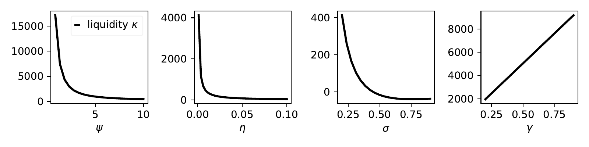{style="width: 60%; display: block; margin: -2% auto 0;"}

</v-click>
</v-click>

---

# Findings, and bridge to Part II

<u>**Finding 1.**</u> The risk-averse LP **reduces depth** rather than hedge. Beyond a critical ratio $\phi / \eta$, **liquidity provision ceases**

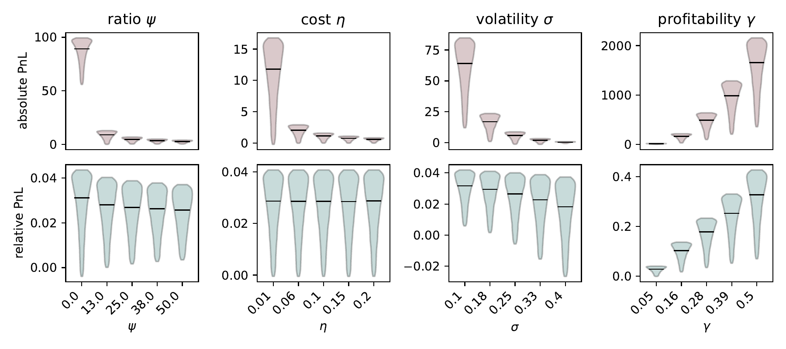{style="width: 50%; display: block; margin: -2% auto 0;"}

<v-click>

<u>**Finding 2.**</u> Private information is non-monotonic. Moderate signals raise $\kappa^\star$, strong signals push the LP to **withdraw**

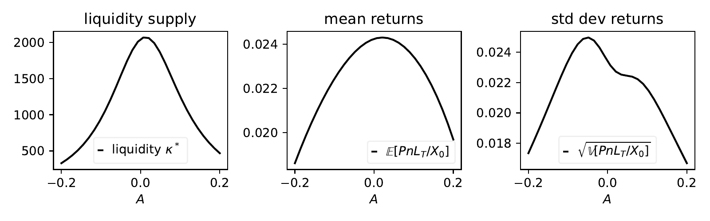{style="width: 50%; display: block; margin: 1% auto 0;"}

</v-click>

---
section: Part II - consensus
---

# Blockchains

### Modern economies rely on trusted intermediaries (banks, clearing houses, platforms)
- intermediaries reduce transaction costs and enforce contracts
- they also introduce frictions: opacity, market power, exclusion, censorship
  
<v-click>

### Can economic activity be coordinated at scale with fewer intermediaries?
- blockchains are a **technological response** to the **frictions** of centralisation
- consensus replaces institutional trust with algorithmic and publicly verifiable rules
  
<v-click>

### Consensus has a price
- **block time**: consensus requires **time** to secure the chain
- **priority fees**: consensus requires **incentives** to compensate block builders
  

<v-click>

### This talk
- what do these design choices imply for the markets that live on the chain?

</v-click>
</v-click>
</v-click>

---

# The price of consensus: block time
### One consensus round **$=$ block time**
<u>During the round</u>: network communications to verify transactions   transactions accumulate in a **memory pool** without being executed   
<u>At the end of the round</u>:  consensus protocol selects a **builder**  
The builder assembles the next block from the memory pool, ordered by **priority fees**

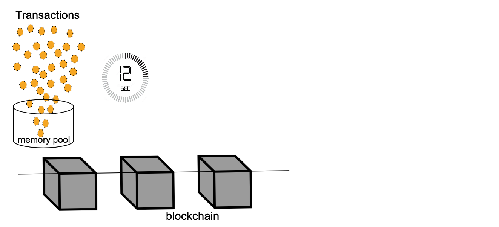{style="transform: translate(30%, -6%); width: 580px"}

<v-click>

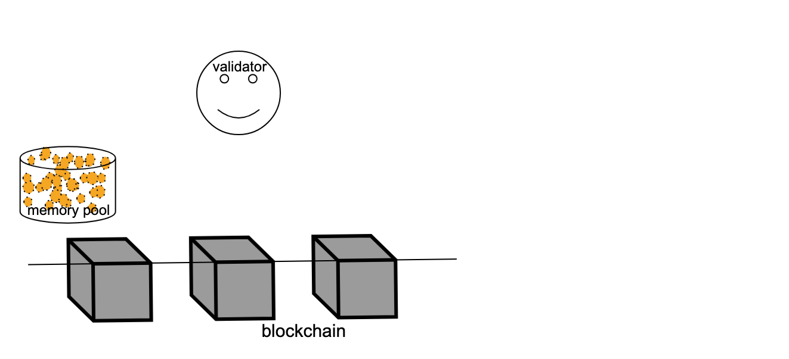{style="transform: translate(30%, -108.1%); width: 580px"}

</v-click>

<v-click>

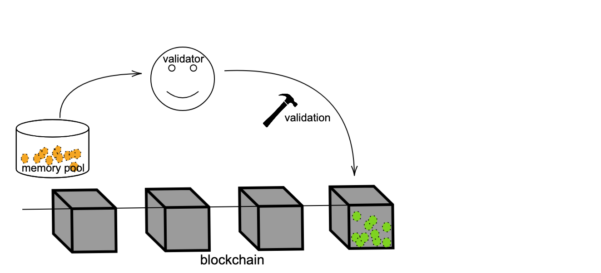{style="transform: translate(30%, -216%); width: 580px"}

</v-click>

---

# The price of consensus: priority fees
### The protocol lets traders pay **priority fees** for faster inclusion in a block

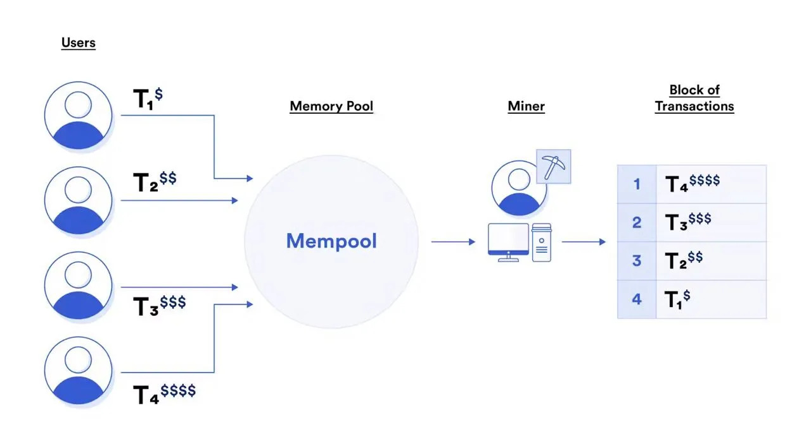{style="transform: translate(40%, 0%); width: 480px"}

* Transactions are ordered by priority fee, not by submission time $\implies$ **auction with discriminatory pricing**
* These fees go to builders, incentivising them to secure the chain

<v-click>

* Positive bids signal informed activity: informed traders **do not pool with noise traders** to hide their flow  
 
</v-click>

---

# Consensus shapes microstructure
### Traditional markets with continuous trading: cleared over multiple short rounds

  

  
MM ↔ IT/NT

  

  

  
MM ↔ IT/NT

  

  

  
MM ↔ IT/NT

  

  

  
MM ↔ IT/NT

  

  

  
MM ↔ IT/NT

  

  

  
MM ↔ IT/NT

  

  

  
MM ↔ IT/NT

  

  

  
MM ↔ IT/NT

  

  

    

<v-click>

### Blockchain markets with discrete trading: cleared in a single auction with discriminatory pricing

  

  

  

  
MM ↔ IT/NT

  

  

     
  block time T
  block creation

 

</v-click>

---
layout: two-cols-header
---
# Consensus shapes microstructure

### Traders wait until the end of block time $\implies$ the round at $T$ is a **sealed-bid auction**

  

  

  

  

  

  
  block time T
  sealed-bid auction among informed traders

<v-click>

  

### Two types of memory pools, late bidding in both

</v-click>

::left::

<v-clicks>

* **Private memory pools**: bids are concealed until block creation $\implies$ traders submit at the last moment  

* **Public memory pools.** Late bidding is the dominant strategy because (i) early bids leak information, (ii) revisions increase the priority fee,  (iii) waiting incorporates recent information
  * *pure-noise hypothesis* of Biais, Hillion, and Spatt (1999)

</v-clicks>

::right::

<v-click at="3">

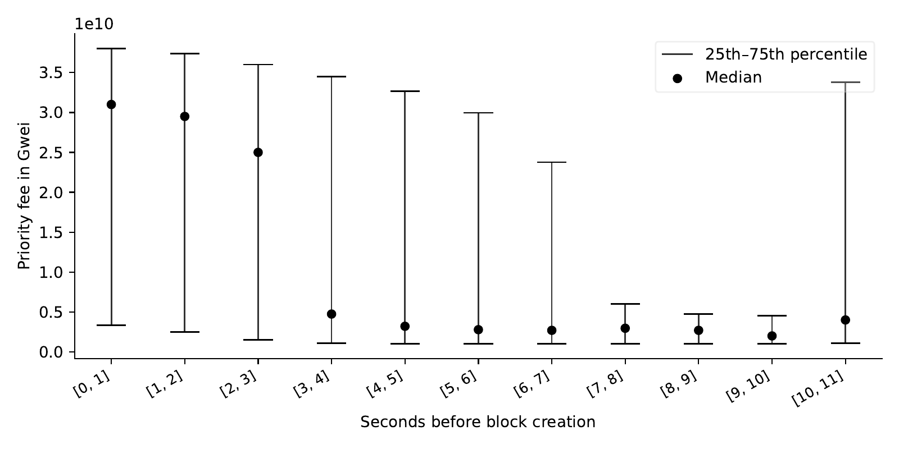{style="transform: translate(0%, -25%); width: 100%;"}

</v-click>

---

# This paper

### Can the blockchain itself be a venue for price formation?

<v-clicks>

1. A model of price formation and liquidity on a blockchain, with **discrete clearing** and **paid-priority** ordering

2. We endogenise: information acquisition, liquidity supply, participation, trading volumes, priority fees

3. The features that secure decentralisation (block time and priority fees) **undermine market viability**

</v-clicks>

---

# Finding 1: endogenous selection
### **Endogenous selection:** paid priority creates a participation cutoff

* Trader i has valuation $v_i$

<svg viewBox="0 0 800 110" preserveAspectRatio="xMidYMid meet" style="width: 100%; height: auto; display: block;">
  <line x1="40" y1="6" x2="40" y2="96" stroke="#444" stroke-width="1"/>
  <line x1="40" y1="96" x2="790" y2="96" stroke="#444" stroke-width="1"/>
  <text x="6" y="12" style="font-size: 9px;" fill="#444">price</text>

  <path d="M 40 90 L 110 90 L 110 55 L 180 55 L 180 41 L 250 41 L 250 30 L 320 30 L 320 25 L 390 25 L 390 22 L 790 22"
        stroke="#1e40af" stroke-width="2" fill="none"/>

  <line x1="40" y1="35" x2="790" y2="35" stroke="#dc2626" stroke-width="1.2" stroke-dasharray="5,3"/>
  <text x="125" y="31" text-anchor="end" style="font-size: 10px; font-style: italic;" fill="#dc2626">trader i's valuation</text>

  <circle cx="250" cy="35" r="4" fill="#dc2626"/>
</svg>

block

  

    
txn # 1

    
valuation: <i>v</i>(1)

  

  

    
txn # 2

    
valuation: <i>v</i>(2)

  

  

    
⋯

    
⋯

  

  

    
txn # <i>N</i>−1

    
valuation: <i>v</i>(<i>N</i>−1)

  

  

    
txn # <i>N</i>

    
valuation: <i>v</i>(<i>N</i>)

  

  

    
uninformed demand

    
priority fee = 0

  

* Low valuation $\implies$ small desired volume $\implies$ small priority fee
* Trader $i$ expects to land late in the queue: if expected impact makes the price exceed her valuation, she has **no incentive to trade**

<v-click>

$\implies$ only sufficiently aggressive traders trade  
$\implies$ Prices are biased toward extreme valuations 

</v-click>

---

# Finding 2: competition reduces liquidity

### Traditional markets

<svg viewBox="0 0 800 195" preserveAspectRatio="xMidYMid meet" style="width: 100%; height: auto; display: block;">
  <!-- Rounds timeline -->
  <line x1="40" y1="50" x2="790" y2="50" stroke="#333" stroke-width="2"/>

  <text x="48" y="22" text-anchor="middle" style="font-size: 9px;" fill="#444">MM ↔ IT/NT</text>
  <circle cx="48" cy="36" r="3.5" fill="#333"/>
  <line x1="48" y1="40" x2="48" y2="50" stroke="#333" stroke-width="1.5"/>

  <text x="152" y="22" text-anchor="middle" style="font-size: 9px;" fill="#444">MM ↔ IT/NT</text>
  <circle cx="152" cy="36" r="3.5" fill="#333"/>
  <line x1="152" y1="40" x2="152" y2="50" stroke="#333" stroke-width="1.5"/>

  <text x="256" y="22" text-anchor="middle" style="font-size: 9px;" fill="#444">MM ↔ IT/NT</text>
  <circle cx="256" cy="36" r="3.5" fill="#333"/>
  <line x1="256" y1="40" x2="256" y2="50" stroke="#333" stroke-width="1.5"/>

  <text x="360" y="22" text-anchor="middle" style="font-size: 9px;" fill="#444">MM ↔ IT/NT</text>
  <circle cx="360" cy="36" r="3.5" fill="#333"/>
  <line x1="360" y1="40" x2="360" y2="50" stroke="#333" stroke-width="1.5"/>

  <text x="464" y="22" text-anchor="middle" style="font-size: 9px;" fill="#444">MM ↔ IT/NT</text>
  <circle cx="464" cy="36" r="3.5" fill="#333"/>
  <line x1="464" y1="40" x2="464" y2="50" stroke="#333" stroke-width="1.5"/>

  <text x="568" y="22" text-anchor="middle" style="font-size: 9px;" fill="#444">MM ↔ IT/NT</text>
  <circle cx="568" cy="36" r="3.5" fill="#333"/>
  <line x1="568" y1="40" x2="568" y2="50" stroke="#333" stroke-width="1.5"/>

  <text x="672" y="22" text-anchor="middle" style="font-size: 9px;" fill="#444">MM ↔ IT/NT</text>
  <circle cx="672" cy="36" r="3.5" fill="#333"/>
  <line x1="672" y1="40" x2="672" y2="50" stroke="#333" stroke-width="1.5"/>

  <text x="776" y="22" text-anchor="middle" style="font-size: 9px;" fill="#444">MM ↔ IT/NT</text>
  <circle cx="776" cy="36" r="3.5" fill="#333"/>
  <line x1="776" y1="40" x2="776" y2="50" stroke="#333" stroke-width="1.5"/>

  <!-- Liquidity axes -->
  <line x1="40" y1="70" x2="40" y2="180" stroke="#444" stroke-width="1"/>
  <line x1="40" y1="180" x2="790" y2="180" stroke="#444" stroke-width="1"/>
  <text x="6" y="76" style="font-size: 9px;" fill="#444">liquidity</text>
  <text x="40" y="192" text-anchor="start" style="font-size: 9px;" fill="#444">t = 0</text>
  <text x="790" y="192" text-anchor="end" style="font-size: 9px;" fill="#444">t = T</text>

  <!-- Liquidity step function: 8 transitions aligned to the 8 rounds above -->
  <path d="M 40 165 L 48 165 L 48 155 L 152 155 L 152 145 L 256 145 L 256 135 L 360 135 L 360 125 L 464 125 L 464 115 L 568 115 L 568 105 L 672 105 L 672 95 L 776 95 L 776 85 L 790 85"
        stroke="#1e40af" stroke-width="2" fill="none"/>
  <text x="500" y="80" text-anchor="start" style="font-size: 10px;" fill="#1e40af">traditional market: multiple rounds, depth improves</text>

  <!-- Blockchain reference, flat from t = 0 -->
  <line x1="40" y1="172" x2="790" y2="172" stroke="#dc2626" stroke-width="2" stroke-dasharray="5,3"/>
  <text x="785" y="168" text-anchor="end" style="font-size: 10px;" fill="#dc2626">blockchain: single round, depth flat from t = 0</text>
</svg>

* **Traditional markets**: information leaks across rounds, liquidity improves over time (Holden and Subrahmanyam, 1992)
* **Blockchain markets**: LP makes a single liquidity decision at $t = 0$ and absorbs all informed flow at once

<v-click>

* Only aggressive traders participate $\implies$ defensive liquidity provision

<v-click>

* **More uninformed demand** $\implies$ more entry $\implies$ **less liquidity**

</v-click>
</v-click>

---

# Finding 3: block time worsens these effects

### Block time is double-edged
* longer blocks help consensus security
* but 
  - widen valuation dispersion
  - shrink uninformed demand

<v-click>

- Beyond a critical $T$, markets shut down

</v-click>

---
section: Model
---

# The market

- A DEX for a risky asset $Y$ priced in a reference asset $X$ (e.g., a stablecoin)

<v-clicks>

- $V_0 = 0$: pre-block reference price (normalised w.l.o.g.)
- $V$: future (random) liquidation value
- $\kappa$: depth of liquidity in the DEX (chosen by the LP)
- $\pi$: proportional DEX fee

</v-clicks>

---
layout: two-cols-header
---

# From bonding curve to linear schedule
### DEXs use a convex bonding curve $\Gamma$

::left::

{style="width: 88%; display: block; margin: 0 auto;"}

Buying $\delta$ units:  
- price per unit $\frac{\Gamma(y-\delta) - \Gamma(y)}{\delta}$
- impact per unit $\frac{-\Gamma'(y-\delta)+\Gamma'(y)}{\delta}$

<v-click>

Linear approximation for small $\delta$:
$$\underbrace{\delta/\kappa}_{\text{slippage}} \qquad \underbrace{2\delta/\kappa}_{\text{impact}} \qquad  \kappa = 2/\Gamma''(y)$$

</v-click>

::right::

<v-click>

### The linear approximation is accurate in practice

.png){style="width: 100%;"}

Realized slippage and price impact match the linear approximation for 2.6M Uniswap v3 trades (Jan to Dec 2023).

</v-click>

---

# Execution prices in the DEX

#### <u>**Linear price schedule**</u>. Buying a quantity $\delta$ executes at

$$\underbrace{V_0}_{=0} \;+\; \underbrace{\delta/\kappa}_{\text{slippage}} \;+\; \underbrace{\pi}_{\text{DEX fee}}\quad\text{ per unit},\qquad\text{cash paid: } \delta\,(\delta/\kappa + \pi)$$

<v-click>

#### <u>**Linear price update rule**</u>. After a buy of size $\delta$, the marginal price moves to

$$
2\,\delta/\kappa
$$

Deeper $\kappa$ $\implies$ cheaper liquidity and smaller impact

<v-click>

 

### Example

- Trader 1 buys $\delta_1$ first, then trader 2 buys $\delta_2$
- Trader 1 pays $\delta_1/\kappa + \pi$ per unit
- The marginal price moves to $2\delta_1/\kappa$
- Trader 2 starts from $2\delta_1/\kappa$ and pays $\underbrace{2\delta_1/\kappa}_{\text{impact from trader 1}} \,+\, \underbrace{\delta_2/\kappa}_{\text{own slippage}} \,+\, \pi \quad\text{per unit}$ $\implies$ competition

</v-click>

</v-click>

---

# The three-stage game

- <u>**Stage one**</u>: $M$ traders pay an information cost $C$ to enter the blockchain
- <u>**Stage two**</u>: liquidity supplier sets DEX depth $\kappa$
- <u>**Stage three**</u>: informed traders compete in the priority gas auction (PGA)
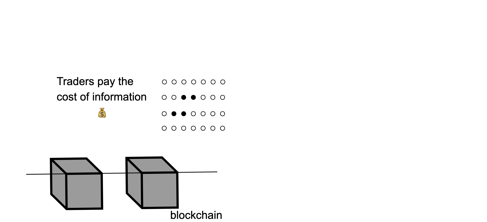{style="transform: translate(10%, 9%); width: 600px"} 
<v-click>

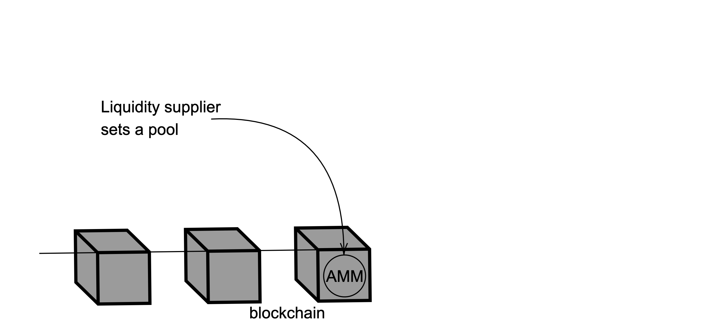{style="transform: translate(13%, -95%); width: 600px"}
<v-click>

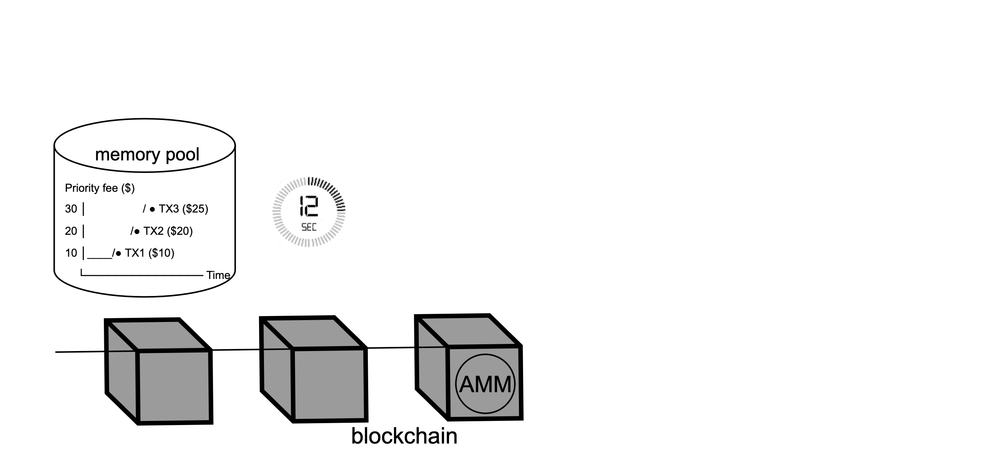{style="transform: translate(13%, -200%); width: 600px"}
<v-click>

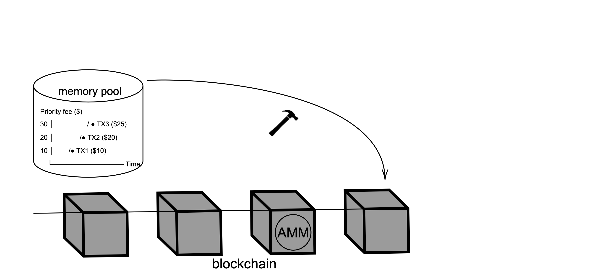{style="transform: translate(13%, -305%); width: 600px"}

We solve by **backward induction**, starting from stage three and working back to stage one

</v-click>
</v-click>
</v-click>

---
section: Solution
---

# <ins>Stage three</ins>: assumptions

<v-clicks>

* $M$ risk-neutral informed traders compete for queue priority in a **single** sealed-bid round at the end of block time
* All informed traders are on the **same side** (block time is long enough for the sign of the innovation to be known). We discuss buyers (sellers symmetric)
* Each trader $i$ observes a private valuation $v_i \sim F$ on $[0,\overline v]$, i.i.d. across traders, with density $f$
* Trader $i$ chooses
    * a **trading volume** $\delta_i$
    * a **priority fee** $\varphi_i$
* The PGA is **multi-prize all-pay sealed-bid**: every transaction is executed, the priority fee is paid, and the surplus depends on **rank**

</v-clicks>

---

# <ins>Stage three</ins>: trader's wealth

If trader $i$ ends up at position $j+1$ in the block (so $M-1-j$ rivals execute first), her execution price per unit is
$$
\underbrace{\delta_i/\kappa}_{\text{own slippage}} \;+\; \underbrace{\frac{2}{\kappa}\sum_{\ell=j+1}^{M-1}\delta_{(\ell)}}_{\text{adverse impact from rivals ahead}} \;+\; \pi
$$

<v-click>

Taking expectations and rearranging across the $M$ rank events,
$$\small
\mathbb E_i[W_i] \;=\; \underbrace{-\varphi_i}_{\text{priority fee}} \;+\; \underbrace{\delta_i\bigl(v_i - \pi - \delta_i/\kappa\bigr)}_{\text{execution costs}} \;-\; \underbrace{C}_{\text{information cost}} \;-\; \underbrace{\frac{2\delta_i}{\kappa}\sum_{j=0}^{M-1}\mathbb E_i\!\left[\mathbf 1_{\varphi_{(j)}<\varphi_i<\varphi_{(j+1)}}\,\Delta_{(j+1:M-1)}\right]}_{\text{expected adverse price impact}}
$$

</v-click>

<v-click>

- The trader solves
$$\sup_{\delta_i}\sup_{\varphi_i}\mathbb E_i[W_i]$$

- In equilibrium: $\qquad\qquad\qquad\qquad\qquad\qquad\quad\delta_i^\star=\delta(v_i) \qquad \varphi_i^\star = \varphi(\delta_i)= \varphi(\delta(v_i))$

</v-click>

---

# <ins>Stage three</ins>: a multi-prize all-pay contest

### Step 1: fix a distribution of volumes G, solve the priority fee
- Rewrite the wealth as
$$\small
\mathbb E_i[W_i] \;=\; \underbrace{\mathbb E_i[W_{i,(0)}]}_{\text{expected worst payoff}} \;+\; \underbrace{\frac{2\delta_i}{\kappa}\sum_{j=0}^{M-1}\mathbb E_i\!\left[\mathbf 1_{\{\varphi_{(j)}<\varphi_i<\varphi_{(j+1)}\}}\,\Delta_{(1:j)}\right]}_{\text{surplus} \;=\; \text{avoided price impact}}
$$

- Trader $i$ optimises $\varphi_i$ alone ($\delta_i$ fixed). Only $-\varphi_i$ and the surplus depend on $\varphi_i$, so
$$\small
\sup_{\varphi_i}\mathbb E_i[W_i] \;=\; \sup_{\varphi_i}\left\{-\varphi_i \;+\; \text{surplus}(\varphi_i)\right\}
$$

<v-click>

- <u>**Lemma:**</u> for $M\ge 2$,
$$\small
\text{surplus}(\varphi_i) = \frac{2\delta_i}{\kappa}\sum_{j=0}^{M-1}\mathbb E_i\!\left[\mathbf 1_{\{\varphi_{(j)}<\varphi_i<\varphi_{(j+1)}\}}\,\Delta_{(1:j)}\right] \;=\; \frac{2\delta_i}{\kappa}\,(M-1)\!\int_0^{\varphi^{-1}(\varphi_i)}\! x\,dG(x)
$$
the relevant statistic is the *unordered* set of competitors' volumes below the inverse bid
</v-click>

---

# <ins>Stage three</ins>: equilibrium priority fee

<u>**Proposition:**</u> for $M\ge 2$ and a fixed distribution $G$ of volumes 
Symmetric Bayesian-Nash priority fee: $\qquad\qquad\quad\varphi_i^\star = \dfrac{2}{\kappa}(M-1)\!\int_0^{\delta_i}\! x^2\,dG(x)$   
Equilibrium objective: $\qquad\qquad\qquad\qquad\quad\qquad\  -\varphi_i^\star + \dfrac{2\,\delta_i}{\kappa}(M-1)\!\int_0^{\delta_i}\!x\,dG(x)\ge 0$

  
<v-click>

- The reservation fee $\frac{2\delta_i}{\kappa}(M-1)\!\int_0^{\delta_i}\!x\,dG(x)$ makes a trader with volume $\delta_i$ indifferent between participating and abstaining
- Traders shade below the reservation fee, by an amount that grows with $\delta_i$
- $\varphi$ is **increasing in $\delta_i$**, **increasing in $M$**, **decreasing in $\kappa$**

</v-click>

---

# <ins>Stage three</ins>: endogenising volumes
### Step 2: obtain the endogenous distribution of volumes G
Substitute $\varphi(\delta_i)$ into the objective. Trader $i$'s optimisation in volume becomes
$$\small
\sup_{\delta_i}\!\left\{\delta_i\bigl(v_i-\pi-\delta_i/\kappa\bigr)\;-\;\frac{2(M-1)}{\kappa}\!\left(\int_0^{\delta_i}\!x^2 dG(x) + \delta_i\!\int_{\delta_i}^{\overline\delta}\! x\,dG(x)\right)\right\}
$$

<v-click>

Using $G(x) = F(\delta^{-1}(x))$ (monotone volumes) yields the linear ODE in $\delta$:
$$
\delta'(v_i) \;=\; \frac{\kappa}{2} \;+\; (M-1)\,f(v_i)\,\delta(v_i)\,.
$$
<v-click>

<u>**Lemma (cutoff).**</u> Fix $M\ge 2$. There exists a unique $\underline v_M \in (0,\overline v)$ satisfying
$$
\delta(\underline v_M) = 0 \qquad  \qquad  \underline v_M - \pi \;=\; \int_{\underline v_M}^{\overline v}\!\Big(e^{(1-F(u))(M-1)} - 1\Big)\,du\;
$$
**Comparative statics.** 
$$
\partial_M\underline v_M \;>\; 0\,, \qquad \lim_{M\to\infty}\underline v_M = \overline v\,.
$$

</v-click>
</v-click>

---

# <ins>Stage three</ins>: equilibrium volumes

<u>**Proposition.**</u>   For $v_i < \underline v_M$: $\qquad\qquad\qquad\qquad\qquad\qquad\quad\ \ \ \delta(v_i) = 0$ (trader abstains).   For $v_i \ge \underline v_M$:
$$
\delta(v_i) \;=\; \underbrace{\kappa}_{\text{available depth}}\times\;\tilde\delta(v_i)
$$
with
$$\small
\tilde\delta(v_i) \;=\; \frac{1}{2}\!\left[(\overline v - \pi)\,e^{-(M-1)(1-F(v_i))} \;-\; \int_{v_i}^{\overline v}\! e^{-(M-1)(F(u) - F(v_i))}\,du\right]
$$

<v-click>

- $\delta(v_i)$ scales **linearly with depth** $\kappa$: deeper DEXs support bigger informed trades
- **Increasing** in own valuation $v_i$ (more information induces more aggression)
- **Decreasing** in $M$ for fixed $v_i$, with $\lim_{M\to\infty}\delta(v_i) = 0$ for every $v_i < \overline v$

</v-click>

<v-click>

The equilibrium priority fee, with endogenous volumes:
$$\small
\varphi(v_i) \;=\; 2\kappa(M-1)\!\int_{\underline v_M}^{v_i}\!\tilde\delta(x)^2 dF(x)\,,\qquad \lim_{M\to\infty}\varphi(v_i) = 0\ \text{ for } v_i < \overline v.
$$

</v-click>

---

# <ins>Stage three</ins>: endogenous selection

<u>**Lemma.**</u> Aggregate active volume has a closed form:
$$
\kappa\,M\!\int_{\underline v_M}^{\overline v}\!\tilde\delta(x)\,dF(x) \;=\; \kappa\cdot\frac{M(\underline v_M - \pi)}{2(M-1)} \;\xrightarrow[M\to\infty]{}\; \kappa\cdot\frac{\overline v - \pi}{2}
$$
Expected DEX price at the end of the block also has a closed form:
$$
\frac{M(\underline v_M - \pi)}{M-1} \;\xrightarrow[M\to\infty]{}\; \underbrace{\overline v - \pi}_{\text{upper bound of valuation support net of fees}}
$$

<v-click>

   

### The mechanism: endogenous selection

- As $M \uparrow$, $\underline v_M \uparrow$, and activity is trapped in the **upper tail** of $F$
- Prices become **systematically biased upward** (downward, for sellers), irrespective of $F$
- *More competition reveals* **less** *information,* not more

</v-click>

---

# <ins>Stage three</ins>: empirical evidence

- Only high-valuation traders participate: per-transaction trade size $\approx$ \$70k on Uniswap v3 vs $\approx$ \$1.2k on Binance for the same pair

- Higher valuations lead to larger volumes, higher priority fees, and better queue positions:

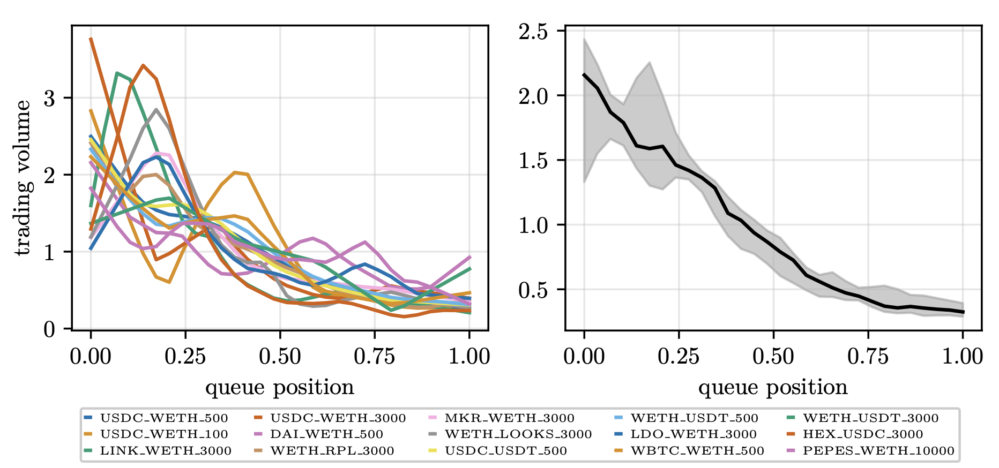{style="transform: translate(20%, 0%); width: 580px"}

Average absolute trading volume across multiple Uniswap v3 pools, as a function of queue position in the block. Position 0 = first to execute, 1 = last.

---

# <ins>Stage two</ins>: liquidity supplier's problem

A representative risk-neutral LP balances **fee revenue** from price-sensitive uninformed demand against **adverse-selection losses** to informed traders

<v-click>

* Uninformed demand increasing and concave in the price of liquidity. Expected fee revenue:
$$
\pi\,N\,\frac{\kappa}{\kappa + \theta}
$$

</v-click>

<v-click>

* Adverse-selection cost on aggregate informed flow $\Delta_M = \sum_k \delta(v_k)$:
$$
\mathbb E\!\left[-\Delta_M^2/\kappa\right] \;=\; -\kappa\,M\,S_M\,,\qquad S_M \;=\; \int_{\underline v_M}^{\overline v}\!\tilde\delta(u)^2\,dF(u) \;+\; \frac{(\underline v_M-\pi)^2}{4(M-1)}
$$

</v-click>

<v-click>

$\implies$ Deeper $\kappa$ captures more uninformed flow (good), but also amplifies informed volumes since $\delta\propto\kappa$ (bad)  
$\implies$ The LP picks $\kappa$ to balance the two

</v-click>

---

# <ins>Stage two</ins>: equilibrium liquidity

**Zero-profit condition** (free entry to liquidity supply):
$$
\pi\,N\,\frac{\kappa^\star}{\kappa^\star + \theta} \;=\; \kappa^\star\,M\,S_M
\quad\Longrightarrow\quad
\boxed{\;\kappa^\star \;=\; \frac{\pi\,N}{M\,S_M} \;-\; \theta\;}
$$

- $\kappa^\star$ rises with profitability $\pi N$ of uninformed flow
- $\kappa^\star$ falls with dispersion $M\,S_M$ of informed flow
- $\kappa^\star$ falls with price-sensitivity $\theta$ of uninformed demand

 

<v-click>

**Limit.** As $M\to\infty$
$$
\kappa^\star \;\longrightarrow\; \frac{8\,\pi N}{3(\overline v - \pi)^2} \;-\; \theta\qquad \text{from above
}
$$
The limit is **positive only if uninformed flow is large enough** relative to the variance of valuations

</v-click>

---

# <ins>Stage two</ins>: competition reduces liquidity

For uniform $F$, $\quad\kappa^\star(M)$ **strictly decreasing in $M$**.
$$\footnotesize
\kappa^\star(M) \;=\; \frac{8\pi N(M-1)^3}{M(\overline v-\pi)^2\bigl[(M-1)(3M-5) - 2(2M-3)\log M + 2(\log M)^2\bigr]}\;-\;\theta
$$

 

<v-click>

**Why competition hurts on a blockchain.**
- Discrete clearing $\implies$ LP absorbs the full adverse-selection risk in **one decision**
- Paid priority + endogenous selection $\implies$ realised informed flow concentrates near $\overline v$  $\implies$ prices are biased
- Both effects amplify each other as $M$ grows

<v-click>

**Market viability.** Liquidity is non-negative only if
  $$
  \boxed{M\,S_M \le \frac{\pi N}{\theta}}
  $$
- If variance of valuations exceeds  extracted value from uninformed flow, the **market shuts down** (Glosten-Milgrom liquidity freeze)

</v-click>
</v-click>

---

# <ins>Stage one</ins>: information acquisition

Traders enter and pay $C$ if expected profits cover the cost. The equilibrium number $M^\star$ is the **largest integer** such that
$$
C \;\le\; H(M)\,,\quad H(M) \;=\; \kappa^\star(M)\!\int_{\underline v_M}^{\overline v}\!\tilde\delta(v)^2\,\bigl[1 - 2(M-1)(1-F(v))\bigr]\,dF(v)
$$

$H(M)$ is the ex-ante trading profit per informed trader, net of execution costs and priority fees, and satisfies
$$
\limsup_{M\to\infty} H(M) \;\le\; 0\,.
$$

<v-click>

**Comparative statics.**
- $M^\star$ **increases** with $\pi N$ (more uninformed profit to extract)
- $M^\star$ **decreases** with the information cost $C$

</v-click>

<v-click>

**Paradox.**
- Cheaper information or larger uninformed demand brings more entry $M^\star$ $\implies$ raises the **cutoff** $\underline v_M$ $\implies$ **less** price discovery
- The opposite of what Grossman and Stiglitz (1980) predict

</v-click>

---
section: Block time
---

# Block time, a tradeoff between security and efficiency

Block time $T$ is the length of one clearing round. It is necessary for consensus, but it shapes the model primitives

<v-click>

<u>**Assumption.**</u>
1. **Valuation support widens with $T$**:  $\overline v(T)$ strictly increasing, and $F(\cdot\,;T')$ strictly first-order stochastically dominates $F(\cdot\,;T)$ for $T' > T$
2. **Effective uninformed demand falls with $T$**:  $N(T)$ decreases

</v-click>

 

<v-click>

### Results

* The participation cutoff $\underline v_M(T)$ is **strictly increasing in $T$**, so longer blocks magnify endogenous selection
* The end-of-block price $\overline v(T) - \pi$ is **increasing in $T$**, so prices drift further from fundamentals

</v-click>

--- 

# Block time: market shutdown

* In the limit $M\to\infty$, the sustainable liquidity
$$
\kappa^\infty(T) \;=\; \frac{8\,\pi\,N(T)}{3\,(\overline v(T) - \pi)^2} \;-\; \theta
$$
is **strictly decreasing** in $T$

<v-click>

* For sufficiently large $T$, &nbsp;&nbsp; $\kappa^\infty(T) \;\le\; 0$ &nbsp; ⟶ &nbsp; **the market collapses**
* The same channel reduces $M^\star$. Longer blocks deter entry into informed trading

</v-click>

 

<v-click>

**Takeaway.**
- Block time is necessary for decentralised consensus, but it impairs markets
- Blockchains are generally **not** viable as the sole venue for price formation under current design
- To become credible infrastructure for price discovery, protocols must rethink **how** transactions are organised within a block

</v-click>

---
layout: end
---
Thank you !

[faycaldrissi.com](https://www.faycaldrissi.com/)

