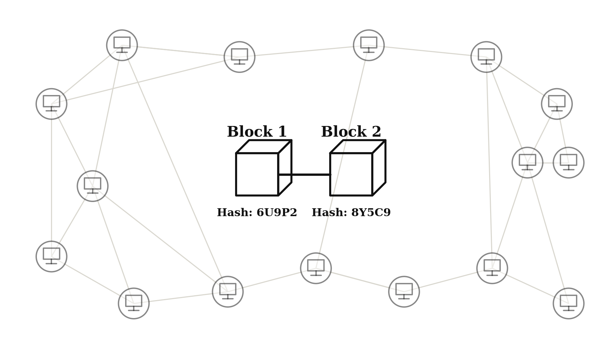
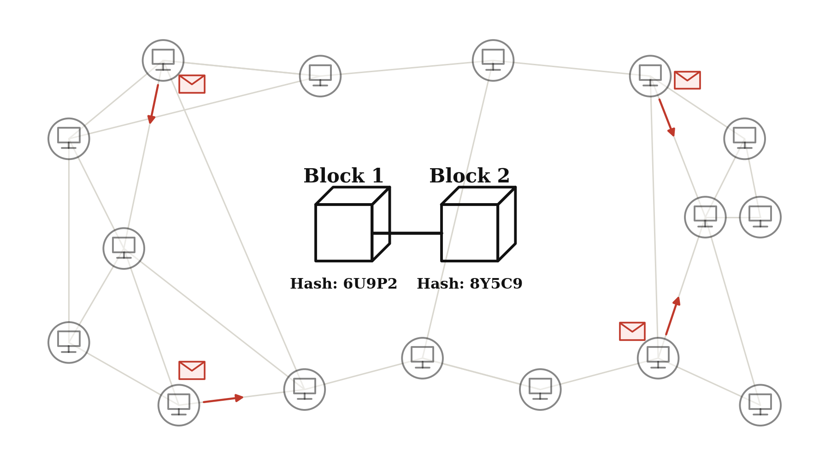
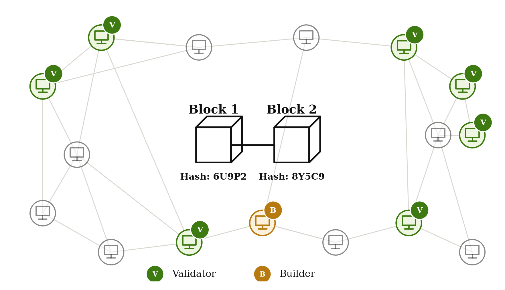
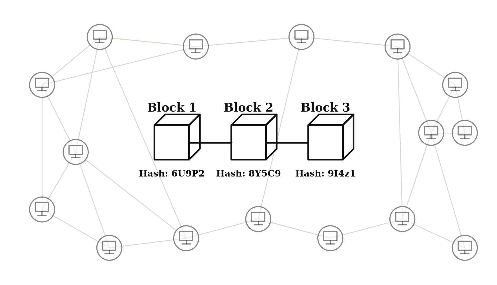
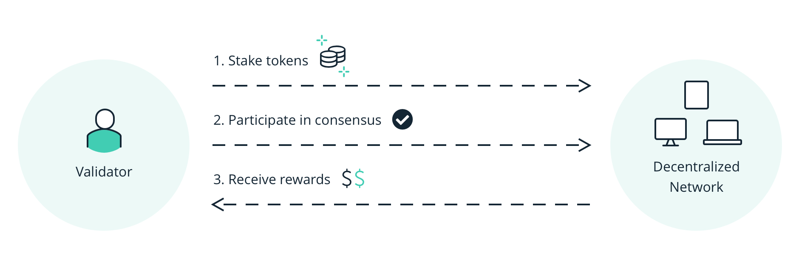
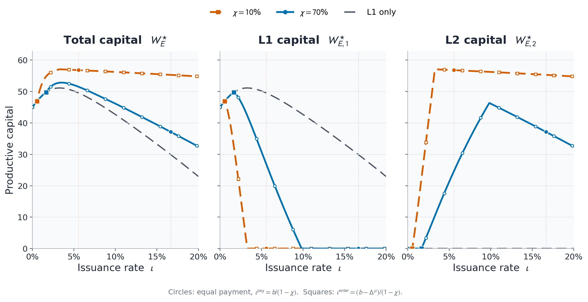
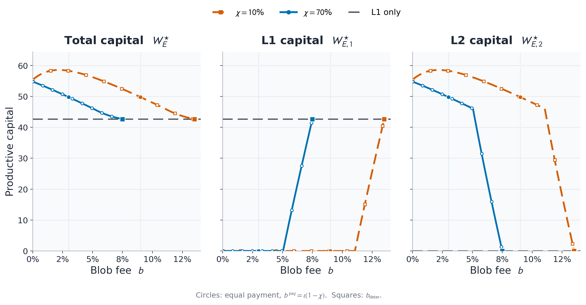
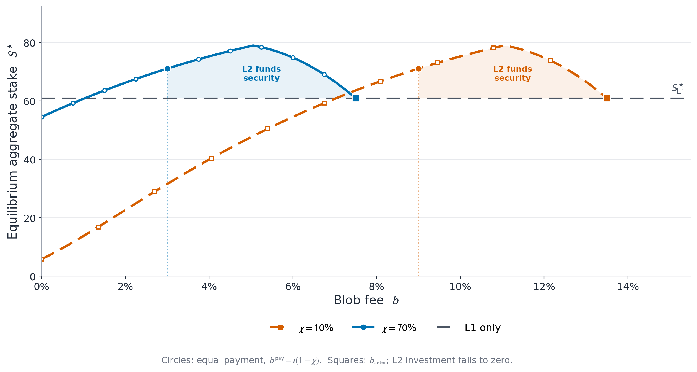

# Price of Proof-of-Stake Security

 
 

### Álvaro Cartea, Nan Chen, Fayçal Drissi, Mingyue Zhong
#### University of Oxford, The Chinese University of Hong Kong

  

##  ICCF 2026

  

---
section: Blockchains
---

# Blockchains

### Promise to coordinate economic activity, at scale, without intermediaries

<v-click>

- the role of blockchain markets is likely to grow
    1. **tokenization** $\$$ 5.5T by 2030 (Citi)
    2.  **stablecoins** $\$$ 310B today
    3. **FX cross-border settlement**

 

<v-click>

$\implies$ important to study

</v-click>
</v-click>

---
layout: two-cols-header
---

# Blockchains

### A distributed, digital, permissionless ledger 
- stores and executes transactions
- without central authority, with *algorithmic consensus*

::left::

<v-click at="1">

 
 
 

#### **Blockchain round**
- transactions are collected, not executed
</v-click>
<v-click at="2">

- network communications, cryptographic work
</v-click>
<v-click at="3">

- block created, transactions executed
</v-click>
<v-click at="4">

$\implies$ consensus requires **time** ($\approx$ 12s)

$\implies$ scaling is difficult

</v-click>

::right::

<v-switch at="-1">
<template #1>

{style="height: 250px;"}

</template>
<template #2>

{style="height: 250px;"}

</template>
<template #3>

{style="height: 250px;"}

</template>
<template #4>

{style="height: 250px;"}

</template>
<template #5>

{style="height: 250px;"}

</template>
<template #6>

{style="height: 250px;"}

</template>
</v-switch>

  

---

# Layer-2 blockchains

- The base chain is called the <b>Layer 1 (L1)</b>: hard to scale to large economic activity
<v-click>

- Scaling solution: <b>Layer 2 (L2)</b> blockchains:
  - Separate private blockchains that extend the L1
  - Aim to enhance the L1 transaction capacity
<v-click>

- L2 has its own infrastructure: efficient and fast processing of transactions
- Periodically posts transaction data to L1
- L2 pays blob fees to stakers for data and settlement
<v-click>

<svg viewBox="0 0 1000 240" style="width:90%; height:230px; display:block; margin:4px auto 0;">
  <defs>
    <marker id="l2-arrow" markerWidth="8" markerHeight="8" refX="7" refY="4" orient="auto">
      <path d="M0,0 L8,4 L0,8 Z" fill="#475569" />
    </marker>
  </defs>

  <text x="18" y="61" style="font-size:14px; font-weight:600; fill:#0f172a;">L2 execution</text>
  <line x1="150" y1="56" x2="970" y2="56" stroke="#94a3b8" stroke-width="2" />

  <g v-click="2">
    <circle cx="190" cy="56" r="9" fill="#cbd5e1" /><text x="187" y="60" style="font-size:8px;">1</text>
    <circle cx="225" cy="56" r="9" fill="#cbd5e1" /><text x="222" y="60" style="font-size:8px;">2</text>
    <circle cx="260" cy="56" r="9" fill="#cbd5e1" /><text x="257" y="60" style="font-size:8px;">3</text>
    <circle cx="295" cy="56" r="9" fill="#cbd5e1" /><text x="292" y="60" style="font-size:8px;">4</text>
    <text x="175" y="25" style="font-size:10px; fill:#475569;">transactions execute continuously</text>
  </g>

  <g v-click="3">
    <rect x="330" y="41" width="86" height="30" rx="6" fill="#334155" />
    <text x="350" y="60" style="font-size:10px; fill:white;">batch 1</text>
    <line x1="373" y1="75" x2="373" y2="167" stroke="#475569" stroke-width="2" stroke-dasharray="6 5" marker-end="url(#l2-arrow)" />
    <rect x="323" y="177" width="100" height="34" rx="6" fill="#e2e8f0" stroke="#475569" stroke-width="1.5" />
    <text x="338" y="198" style="font-size:9px; fill:#0f172a;">settlement 1</text>
  </g>
  
  <g v-click="4">
    <circle cx="500" cy="56" r="9" fill="#cbd5e1" /><text x="497" y="60" style="font-size:8px;">5</text>
    <circle cx="535" cy="56" r="9" fill="#cbd5e1" /><text x="532" y="60" style="font-size:8px;">6</text>
    <circle cx="570" cy="56" r="9" fill="#cbd5e1" /><text x="567" y="60" style="font-size:8px;">7</text>
    <circle cx="605" cy="56" r="9" fill="#cbd5e1" /><text x="602" y="60" style="font-size:8px;">8</text>
  </g>

  <g v-click="5">
    <rect x="650" y="41" width="86" height="30" rx="6" fill="#334155" />
    <text x="670" y="60" style="font-size:10px; fill:white;">batch 2</text>
    <line x1="693" y1="75" x2="693" y2="167" stroke="#475569" stroke-width="2" stroke-dasharray="6 5" marker-end="url(#l2-arrow)" />
    <rect x="643" y="177" width="100" height="34" rx="6" fill="#e2e8f0" stroke="#475569" stroke-width="1.5" />
    <text x="658" y="198" style="font-size:9px; fill:#0f172a;">settlement 2</text>
  </g>

  <text x="18" y="199" style="font-size:14px; font-weight:600; fill:#0f172a;">L1 settlement</text>
  <line x1="150" y1="194" x2="970" y2="194" stroke="#94a3b8" stroke-width="2" />
</svg>

</v-click>
</v-click>
</v-click>

---

# Security in Proof-of-Stake blockchains

### Stakers lock native tokens to participate in consensus

{style="width:50%; margin-top:0px; margin-left:200px;"}

<v-clicks>

- **Discipline:** misconduct can be punished through slashing
- **Incentives:** honest validators receive newly issued tokens
  - This is an inflation tax on token holders
- **Economic security:** a larger dollar value of stake $S$ makes attacks more expensive
- L1 stake protects both L1 activity and the L2s that settle on it
- L2 inherits security from L1

</v-clicks>

---

# Productivity in Proof-of-Stake blockchains

### Productivity
- Blockchains offer decentralized financial (DeFi) services (trading, banking, lending, borrowing, insurance)
- Investors lock tokens in these smart contracts
- They earn revenue (fees) from users who use the DeFi services
- Invested capital is taxed and pays security

<v-click>

 

### L1 versus L2
- L2 blockchains are significantly faster $\implies$ more demand from users $\implies$ more revenue to investors
- Only a fraction of productive capital on L2s is held in the native token  ($73\%$ on Linea and $0.5\%$ on Lighter)
  - contribute less to the inflation tax $\implies$ pays less for security

</v-click>

---

# Research question

What is the effect of L2s on the security and productivity of a blockchain economy?

<v-clicks>

L2 efficiency attracts capital and enlarges the base that can finance security 

But each dollar of L2 capital generates less demand for tokens -> less issuance revenue

Blob fees must balance adoption gain against security

</v-clicks>

---
section: Model
---

# Agents and timing

### Small open economy with an L1, an L2, and three agent types

- **Investors:** allocate productive capital across L1 and L2
- **Stakers:** choose how much capital to lock on L1 and participate in consensus
- **Users:** demand DeFi services

<b>Before stage one (t=0)</b>  
L1 sets issuance rate <i>ι</i> and blob fee <i>b</i>

<b>Stage one (t=1)</b>  
heterogeneous investors decide whether to enter the blockchain economy

<b>Stage two (t=2)</b>  
Investors allocate capital; stakers choose stake

<b>After stage two (t=3)</b>  
Randomness resolves: output, attacks, and transfers are realized

$\implies$ solved by backward induction

---

# Stage two: returns to DeFi (productivity)

#### Revenue from users
- Investors lock capital in L1/L2 in native tokens
- L1 productivity: DeFi services generate $\mu_1$ dollars per dollar invested
- L2 productivity: DeFi services generate $\mu_2>\mu_1$ dollars per dollar invested
<v-click>

 

#### Platform risk in blockchains
- Number of successful attacks on the L1: $J_1 \sim \operatorname{Poisson}(p_1(S))$
- Number of successful attacks on the L2: $J_2 \sim \operatorname{Poisson}(p_2)$
<v-click>

 

#### Issuance of tokens to stakers is a tax on investors
<v-click>

#### Before issuance
- supply  $=2$ tokens, token price $=\$1$ (market cap=$\$2$)
- stakers and investors each hold $1$ token
- stakers and investors each hold $\$1$

#### After issuance (1 token)

- supply $=3$ tokens, token price $=\$2/3$ (market cap=$\$2$)
- stakers hold $2$ tokens, investors hold $1$ token
- stakers own $\$4/3$; investors own $\$2/3$

</v-click>
</v-click>
</v-click>

---
layout: two-cols-header
---

# Stage two: returns to DeFi (productivity)
### Issuance tax
- Issuance is a tax rate $\iota$ on each invested dollar
- L1 capital is $100\%$ in native tokens $\implies$ tax rate is $\iota$
<v-click>

- A share $\chi$ of L2 capital is in native tokens $\implies$ tax rate is $\iota\,\chi$. $\qquad$ In practice: $\chi$ is $73\%$ on Linea and $0.5\%$ on Lighter

 
<v-click>

### Blob fees 
- L2 pays blob fees to stakers $\implies$ L2 makes users pay the blob fee $\implies$ users reduce demand proportionally

</v-click>
</v-click>

 

::left::

<v-click at="3">

### Dollar return to L1 investment

$$ \small
\boxed{R_1(S)=\mu_1-\kappa_1\,J_1(S)-\iota}
$$

L1 platform risk
$$ \small
\boxed{p_1(S)=\underline p_1+
\frac{\bar p_1-\underline p_1}{1+\eta S}} \quad p_1'(S)<0,\quad p_1''(S)>0
$$

</v-click>

::right::

<v-click at="4">

#### Dollar return to L2 investment
$$\small
\boxed{R_2(S)=\mu_2-\kappa_1J_1(S)-\kappa_2J_2-\chi\,\iota-b}
$$

security contribution gap: $\small
\boxed{\Delta^\iota=\iota - (\iota\chi + b) = \iota(1-\chi)-b}
$

productivity gap: $\small
\boxed{\Delta^\mu=\mu_2-\mu_1-\kappa_2\,p_2}
$

</v-click>

---

# Stage two: investor portfolio choice

- Contiunuum of investors with aggregate wealth $W_E$
- Each infinitesimal investor takes aggregate stake $S$ as given

<v-switch at="0" unmount>
<template #1>

#### Portfolio problem of investor $i$: mean variance preferences over wealth at $t=3$
$$
\max_{\substack{\omega_{I,1}^i,\omega_{I,2}^i\geq0\\
\omega_{I,1}^i+\omega_{I,2}^i=1}}
\left\{
\mathbb E\left[\widetilde W_I^i/W_I^i\right]-
\frac{\rho_I}{2}\operatorname{Var}\left[\widetilde W_I^i/W_I^i\right]
\right\},
\qquad \rho_I>0
$$

</template>
<template #2>

#### Expected portfolio return

$$
\begin{aligned}
\mathbb E[\widetilde W_I^i/W_I^i]={}&\omega_{I,1}^i
[\mu_1-\kappa_1p_1(S)-\iota]\\
&+\omega_{I,2}^i
[\mu_2-\kappa_1p_1(S)-\kappa_2p_2-\chi\iota-b]
\end{aligned}
$$

</template>
<template #3>

#### Variance of the portfolio return

$$
\operatorname{Var}(R_p^i(S))
=\kappa_1^2p_1(S)+(\omega_{I,2}^i)^2\kappa_2^2p_2
$$

The attack counts are independent: $J_1(S)\perp J_2$.

</template>
</v-switch>

---

# Stage two: returns to staking

- Continuum of stakers who invest in staking or risk-free rate
- Stakers supply L1 security and receive revenue from productive activity
- Each infinitesimal stakers takes aggregate $S$ and the revenues from

#### L1 issuance 

Each dollar of L1 capital pays $\iota$

$$
\iota W_{E,1}
$$

#### L2 issuance

The native-token share $\chi$ pays issuance

$$
\iota\chi W_{E,2}
$$

#### Blob fees

Each dollar of L2 capital pays $b$

$$
bW_{E,2}
$$

<v-click at="3">

$\implies$ staking reward per dollar can be estimated as: 
$$\tau = \frac{1}{S}\left(\iota\,w_{E,1}+\iota\,\chi\,W_{E,2}+b\,W_{E,2}\right)$$

</v-click>

---

# Stage two: staker portfolio choice

#### Dollar return to staking

$$
\boxed{R_S(S)=\tau-\kappa_1J_1(S)}
$$

$$
\mathbb E[R_S(S)]=\tau-\kappa_1p_1(S)
$$

$$
\operatorname{Var}(R_S(S))=\kappa_1^2p_1(S)
$$

<v-click>

#### Portfolio problem of staker $j$

- Stake a fraction $\omega_S^j\geq0$ of wealth $W_S^j$
- Invest the remainder at the risk-free rate $r$

#### Mean–variance preferences over wealth at $t=3$

$\rho_S>0$ is staker risk aversion.

$$
\max_{\omega_S^j\geq0}
\left\{
\mathbb E\!\left[\frac{\widetilde W_S^j}{W_S^j}\right]
-\frac{\rho_S}{2}
\operatorname{Var}\!\left[\frac{\widetilde W_S^j}{W_S^j}\right]
\right\}
$$

</v-click>

---

# Stage two: clearing conditions

### Aggregate productive capital $W_E$ is fixed by stage-one entry

#### DeFi markets

$$
W_{E,1}^\star=\omega_{I,1}^\star W_E
\qquad
W_{E,2}^\star=\omega_{I,2}^\star W_E
$$

#### Staking market

$$
S^\star=\omega_S^\star W_S
$$

<v-click at="2">

#### Security budget

$$
\boxed{\tau^\star S^\star
=\iota W_{E,1}^\star+(\iota\chi+b)W_{E,2}^\star}
$$

</v-click>

---

# Stage one: investor entry

### Investors differ in the minimum surplus they require to enter

#### Private reservation value

$$
\nu^i\sim U[0,\bar\nu]
$$

- Reservation values are independent of wealth and return shocks

#### Entry rule

$$
\text{investor } i \text{ enters}
\iff \nu^i \le \Lambda(S)^2
$$

 

#### $\Lambda(S)^2$ is the investor's risk-adjusted surplus from entry:

$$
\boxed{\Lambda(S)^2
=2\rho_I[\operatorname{U}(S)-r]}
$$

---
section: Solution
---

# Solution

### Solve by backward induction and impose equilibrium consistency

<b>1. Stage two</b>  
Investor and staker portfolio choices for given productive capital

<b>2. Stage one</b>  
Investor entry and productive capital

<b>3. Market clearing</b>  
Entry, rewards, and output agree

---

# Solution: investor portfolio

<v-switch at="0" unmount>
<template #1>

### The L2 advantage has two components

#### Productivity advantage

$$
\Delta^\mu:=\mu_2-\mu_1-\kappa_2p_2
$$

#### Contribution gap

$$
\Delta^\iota:=\iota(1-\chi)-b
$$

$$
\boxed{\Delta=\Delta^\mu+\Delta^\iota}
$$

</template>
<template #2>

### Optimal investor portfolio weights

$$
\boxed{
\omega_{I,2}^\star=
\left[\frac{\Delta}{\rho_I\kappa_2^2p_2}\right]_0^1,
\qquad
\omega_{I,1}^\star=1-\omega_{I,2}^\star
}
$$

$\footnotesize [x]_0^1:=\min\{1,\max\{0,x\}\}$

- Higher L2 productivity advantage $\Delta^\mu$ shifts capital to the L2
- Higher L2 tax rebate $\Delta^\iota$ shifts capital to the L2 
  - Low token share $\chi$
  - Low blob fee $b$

</template>
</v-switch>

 

---

# Solution: staker portfolio

### Equilibrium staking share

$$
\boxed{
\omega_S^\star(S^\star)=
\left[
\frac{\tau^\star-r-\kappa_1p_1(S^\star)}
{\rho_S\kappa_1^2p_1(S^\star)}
\right]_+}
$$

$$\footnotesize
[x]_+:=\max\{0,x\}
$$

- Larger reward $\tau$ from investors $\implies$ more staking
- Larger risk-free opportunity cost $\implies$ less staking
- Larger L1 attack risk $\implies$ less staking

---

# Solution: productive capital

<v-switch at="0" unmount>
<template #1>

### Anticipated value of blockchain investment

$$
m_1(S):=\mu_1-\kappa_1p_1(S)-\iota-r
$$

$$
\Lambda(S)^2
=2\rho_I[m_1(S)+\Delta\omega_{I,2}^\star]
-\rho_I^2\left[
\kappa_1^2p_1(S)+(\omega_{I,2}^\star)^2\kappa_2^2p_2
\right]
$$

</template>
<template #2>

### Entry determines productive capital

$$
\boxed{W_E^\star=\frac{\Lambda(S^\star)^2}{\bar\nu}W_I}
$$

$$
W_{E,1}^\star=\omega_{I,1}^\star W_E^\star,
\qquad
W_{E,2}^\star=\omega_{I,2}^\star W_E^\star.
$$

</template>
</v-switch>

---

# Solution: equilibrium security $S^\star$

### Security budget clearing
- Payments from productive capital $=$ compensation required by stakers

#### Payments from productive capital

$$
\Psi(S)=\underbrace{\frac{W_I}{\bar\nu}\Lambda(S)^2}_\text{aggregate entry}\underbrace{\left(\iota\omega_{I,1}^\star
+(\iota\chi+b)\omega_{I,2}^\star\right)}_\text{payment per dollar}
$$

#### Required staker compensation

$$
\Phi(S)=S\left[
r+\kappa_1p_1(S)
+\frac{\rho_S}{W_S}\kappa_1^2p_1(S)S
\right]
$$

- opportunity cost, L1 attack loss, compensation for attack risk

<v-click>

$$
\boxed{\Phi(S^\star)=\Psi(S^\star)}
$$

</v-click>

---

# Solution: explicit characterization of $S^\star$

### Equilibrium stake is the unique positive root of

$$
\boxed{c_3(S^\star)^3+c_2(S^\star)^2+c_1S^\star-c_0=0}
$$

$$\small
c_0=\Psi_0,\qquad
c_1=r+\kappa_1\bar p_1-\eta\Psi_\infty,\qquad
c_2=\eta(r+\kappa_1\underline p_1)
+\frac{\rho_S}{W_S}\kappa_1^2\bar p_1,\qquad
c_3=\eta\frac{\rho_S}{W_S}\kappa_1^2\underline p_1.
$$

$$\footnotesize
\begin{aligned}
\Psi_0=\Psi(0)
={}&\frac{W_I}{\bar\nu}
\Big[\iota\,\omega_{I,1}^{\star}
+(\iota\chi+b)\omega_{I,2}^{\star}\Big] \times
\Bigg\{
2\rho_I\Big[
\mu_1-\kappa_1\bar p_1-\iota-r
+\Delta\omega_{I,2}^{\star}
\Big]
-\rho_I^2\Big[
\kappa_1^2\bar p_1
+(\omega_{I,2}^{\star})^2\kappa_2^2p_2
\Big]
\Bigg\},
\\[0.8em]
\Psi_\infty=\lim_{S\to\infty}\Psi(S)
={}&\frac{W_I}{\bar\nu}
\Big[\iota\,\omega_{I,1}^{\star}
+(\iota\chi+b)\omega_{I,2}^{\star}\Big] \times
\Bigg\{
2\rho_I\Big[
\mu_1-\kappa_1\underline p_1-\iota-r
+\Delta\omega_{I,2}^{\star}
\Big]
-\rho_I^2\Big[
\kappa_1^2\underline p_1
+(\omega_{I,2}^{\star})^2\kappa_2^2p_2
\Big]
\Bigg\},
\end{aligned}
$$

If payment per dollar = 0, productive capital generates no security revenue and <i>S</i>⋆ = 0.

---
section: Results
---

# Issuance

{style="transform: translate(25%, 0%); width: 600px"}

---

# Blob fees and productivity

{style="transform: translate(25%, 0%); width: 600px"}

---

# Blob fees and security

{style="transform: translate(25%, 0%); width: 600px"}

---
section: Conclusion
layout: end
---

### Core trade-off

L2s attract productive capital, but each L2 dollar contributes less to L1 security

  

Thank you!
